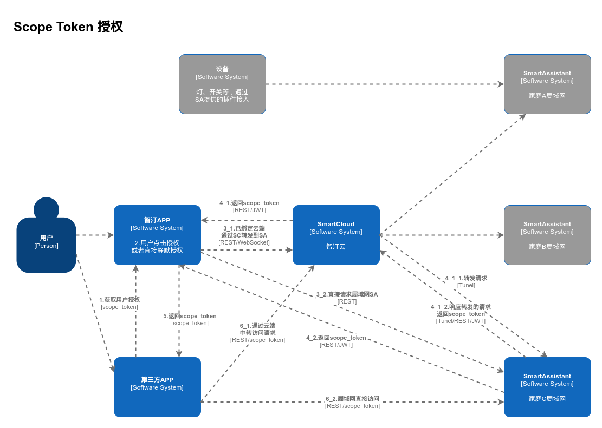

# 用户认证与第三方授权

智汀家庭云提供用户登录认证与第三方授权功能，包括用户凭证、Scope Token与临时密码。

## 用户凭证

每一个用户帐号创建时都会自动生成一个随机的用户凭证，该凭证会保存在智汀家庭云与智汀 APP 内，
使用该凭证可以拥有该用户的所有权限。用户凭证通过 smart-assistant-token HTTP 请求头的方式发送。

## Scope Token

第三方 APP 或者智汀云需要请求智汀家庭云的接口时，需要使用 Scope Token 进行鉴权访问。Scope Token 在生成时
可以选择其拥有的接口权限范围，并且会设置过期时间，保证第三方无法越权使用。Scope Token 通过 scope-token HTTP 请求头发送。

Scope Token 为 JWT 格式，其校验密钥为用户凭证。通常情况下应包含以下字段：

* sa_id: 智汀家庭云初始化时的 ID
* uid: 智汀家庭云中对应的用户 ID
* exp：过期时间
* scopes: 权限范围，字符串，以(,)分隔
* 其他业务相关字段

**注意：敏感信息不能存储于 JWT 中**

Scope Token 授权流程如下：

## 临时密码

通常情况下，智汀家庭云通过颁发 Scope Token 来限制第三方访问范围，但偶尔我们也需要让可信任的第三方执行某些管理功能，
但颁发具有全权限的 Scope Token 又担心存在风险；智汀家庭云提供临时密码来解决此问题：

* 智汀APP使用用户凭证请求智汀家庭云接口，生成临时密码，该临时密码具有用户的所有权限
* 将临时密码输入到可信任的第三方平台（如智汀云）
* 第三方平台凭此临时密码与附加的用户ID，SA-ID等信息访问智汀家庭云接口
* 智汀家庭云处理请求后立刻将该临时密码失效，避免越权使用

