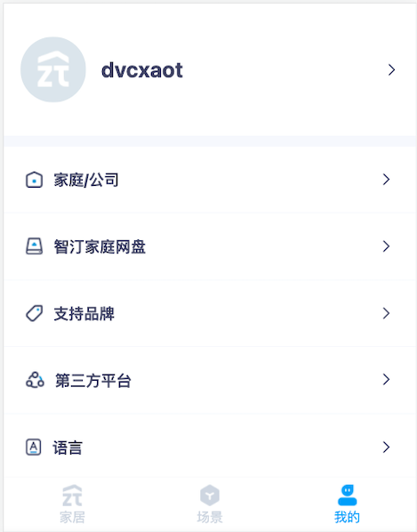

# 使用Docker运行智汀家庭云
本文档描述如何在docker上运行智汀家庭云（以下简称SA），并使用浏览器体验SA。

## 环境准备
- linux主机
- docker
- docker-compose

## 运行SA

### 自行创建docker-compose文件运行

创建一个目录作为SA运行的根目录，并在该目录中创建docker-compose.yaml文件，内容如下：

```
version: "3.9"

services:
  zt-nginx:
    image: docker.yctc.tech/zt-nginx:3.0 
    ports:
      - 9010:9010
      - 9020:9020
      - 9030:9030
    depends_on:
      - smartassistant
  etcd:
    image: bitnami/etcd:3
    environment:
      - ALLOW_NONE_AUTHENTICATION=yes
      - ETCD_GRPC_KEEPALIVE_TIMEOUT=10s
      - ETCD_GRPC_KEEPALIVE_INTERVAL=10s
    ports:
      - 2379:2379
      - 2380:2380
  fluentd:
    image: fluent/fluentd:v1.13
    ports:
      - "24224:24224"
      - "24224:24224/udp"

  smartassistant:
    image: docker.yctc.tech/smartassistant:1.4.0
    ports:
      - "37965:37965"
    volumes:
      - /var/run/docker.sock:/var/run/docker.sock
    depends_on:
      - etcd

```

输入以下命令启动服务：

```shell
docker-compose up
```

### 使用脚本运行SA

#### 注意事项

**运行脚本所需环境**

- awk命令
- openssl
- root用户权限

#### 安装说明

- 执行./build/install/install.sh


- 填写配置并确认


- 安装成功


- 检查运行情况


### 测试运行情况

服务启动后可以通过以下命令检查SA的状态：

```shell
curl http://localhost:37965/api/check
```

如果返回以下内容则说明服务已运行起来并且未被绑定

```json
{"status":0,"reason":"成功","data":{"is_bind":false,"revision":""}}
```

## 使用智汀App进行体验

### SA体验演示

- 点击添加智能设备发现SA


- 选中SA,点击**添加**


- 点击**支持品牌**，界面中会列出SA内置的一些插件


- 点击其中的一个插件，点击**添加**对插件进行安装


- 插件添加成功后，返回到首页**家居**，点击右上角**+**按钮就可以添加插件支持的设备


- 选中其中的一个设备点击**添加**,添加完成后返回到首页的**家居**即可对设备进行操控


## 使用专业版进行体验

### 账号和密码设置

SA服务启动后，如果未绑定，需要发送以下请求对SA进行绑定：

```shell
curl -X POST -d '{"device": {"model": "smart_assistant"}}' http://localhost:37965/api/devices
```

绑定成功后返回以下内容：

```json
{"status":0,"reason":"成功","data":{"device_id":1,"plugin_url":"","user_info":{"user_id":1,"role_infos":null,"account_name":"","nickname":"wyqicai","token":"MTYzNTMxOTE1M3xOd3dBTkVoRE5WRXpTME5CV0VrMFVFOVFWa0pJUjA1UFNVRklRMEUxUkZaWVFsRkNWVWhUVWxWRFEwNUVTek5QU0VwVlJVVlJSMEU9fNXschLMFQtEogQo2AlJu4wfSJfLrsk994FwSGUhp-_3","phone":"","is_set_password":false},"area_info":{"id":"20763937284831135"}}}
```

SA绑定成功后设置用户名和密码：

```shell
curl -X PUT -d '{"account_name": "admin","password": "123456"}' --header 'smart-assistant-token:MTYzNTMxOTE1M3xOd3dBTkVoRE5WRXpTME5CV0VrMFVFOVFWa0pJUjA1UFNVRklRMEUxUkZaWVFsRkNWVWhUVWxWRFEwNUVTek5QU0VwVlJVVlJSMEU9fNXschLMFQtEogQo2AlJu4wfSJfLrsk994FwSGUhp-_3' http://localhost:37965/api/users/1

其中header参数smart-assistant-token值为绑定成功后的token, 
请求url path（/api/users/:id）中的路径参数id为绑定成功后返回的用户id。

```

设置成功后返回：

```json
{"status":0,"reason":"成功"}
```

当用户账号和密码设置成功后打开浏览器，访问 http://localhost:9020 即可体验SA了。

### SA体验演示

- 使用账号密码登录


- 登录成功后，切换到**我的**



- 点击**支持品牌**，界面中会列出SA内置的一些插件


- 点击其中的一个插件对插件进行安装


- 插件添加成功后，返回到首页**家居**，点击右上角**+**按钮就可以添加插件支持的设备


- 选中其中的一个设备点击**添加**,添加完成后返回到首页的**家居**即可对设备进行操控


